# ChronoMate Desktop (PySide6)

A high-precision desktop companion application for the **HT-X3000 / HT-50** airsoft chronograph.

Built with Python and **PySide6**, ChronoMate Desktop transforms the chronograph's built-in web interface into a comprehensive ballistic laboratory and marshaling station with a tactical, high-contrast HUD design.

<p align="center">
  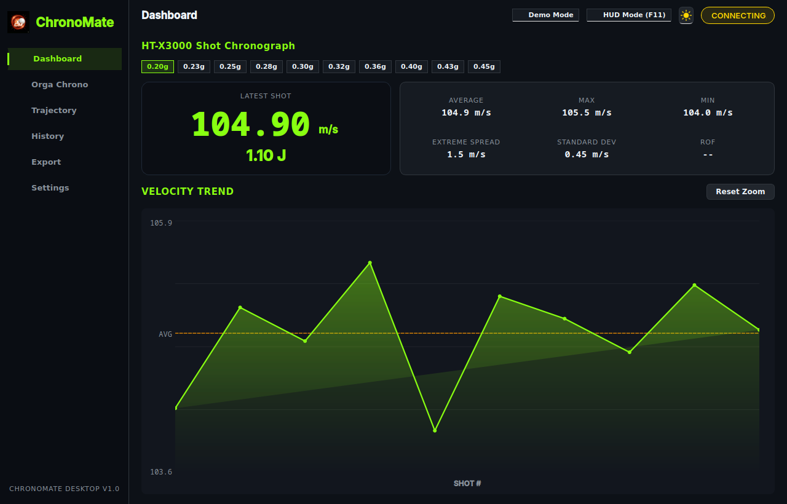
</p>

---

## 📸 Visual Gallery & Interface Tour

| 📊 Advanced Dashboard (Dark Mode) | 🛡️ Orga Chrono (Compliance & Joule Grid) |
|:---:|:---:|
|  | 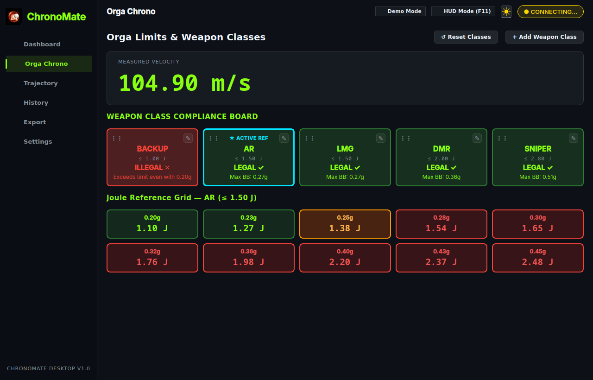 |
| **🏹 Ballistics & Trajectory Simulation** | **📺 Full-Screen Field Station HUD (Orga Mode)** |
| 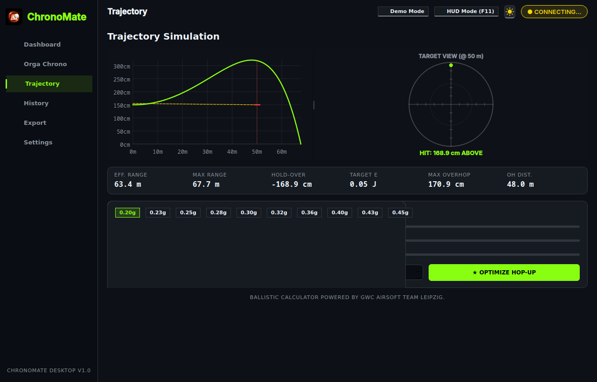 | 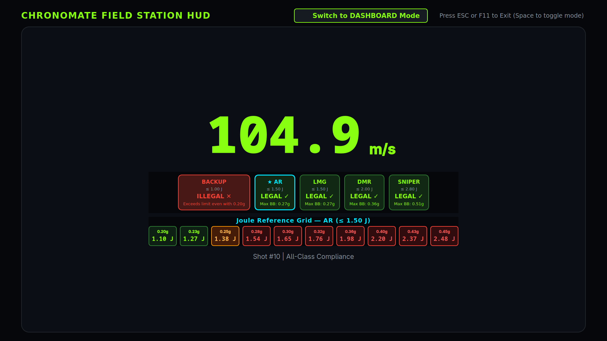 |
| **📋 Session History (Clean 5 Columns)** | **⚙️ Chrono Calibration & Compensation** |
| 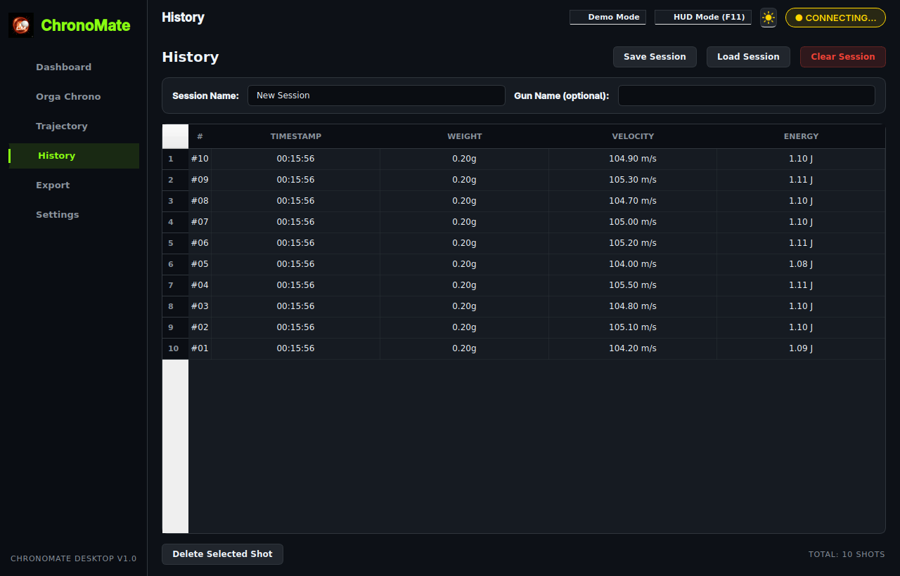 | 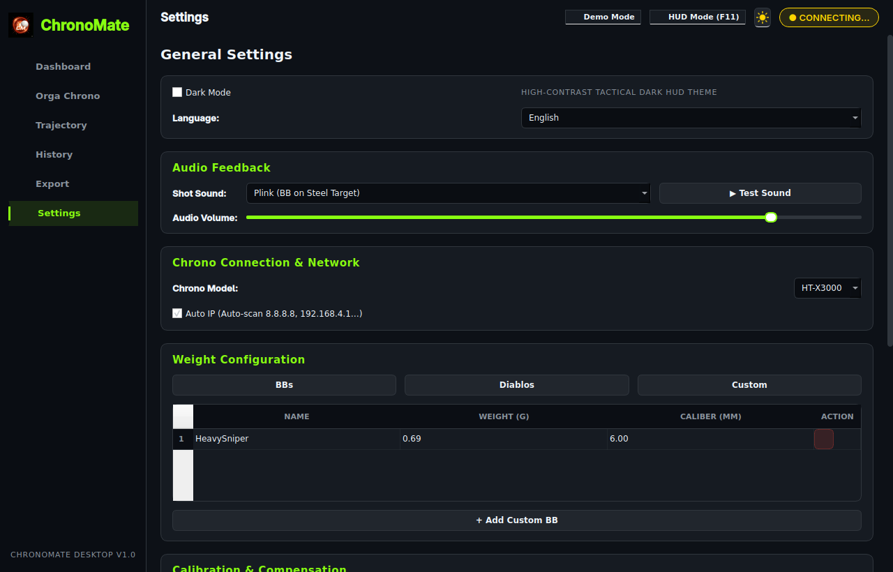 |

<details>
<summary><b>🔍 Click to expand more screenshots (Clean Light Mode, Drag & Drop Reordering, Dialogs, German Localization)</b></summary>

| ☀️ Dashboard (Clean Light Theme) | ⇄ Orga Chrono (Drag & Drop Reordered) |
|:---:|:---:|
| 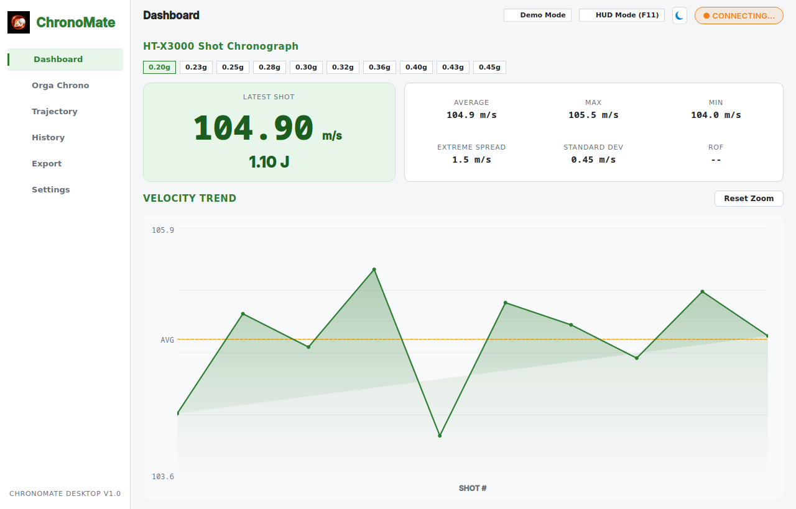 | 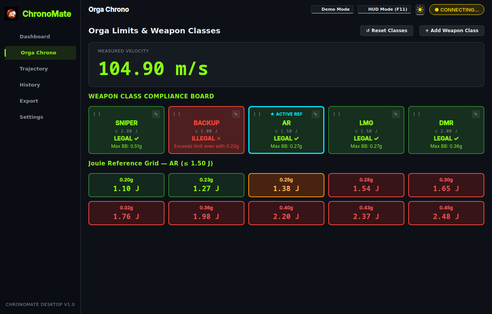 |
| **✏️ Weapon Class Edit & Limits Dialog** | **🇩🇪 Orga Chrono (Deutsche Lokalisierung)** |
| 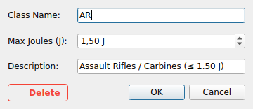 | 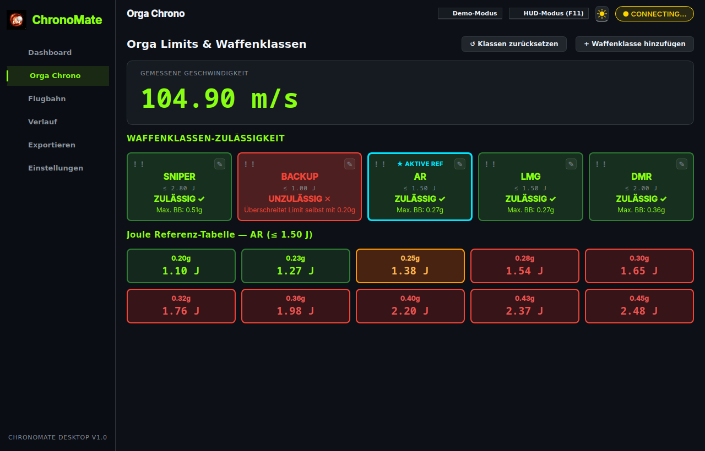 |
| **📺 Field Station HUD (Dashboard Mode)** | **🇩🇪 Field Station HUD (Deutsche Lokalisierung)** |
| 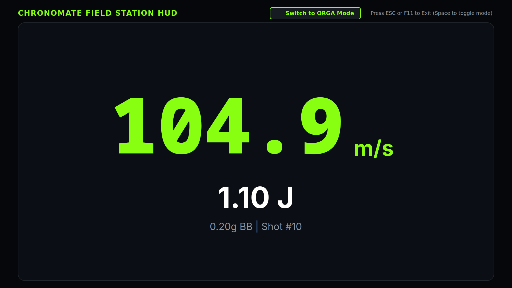 | 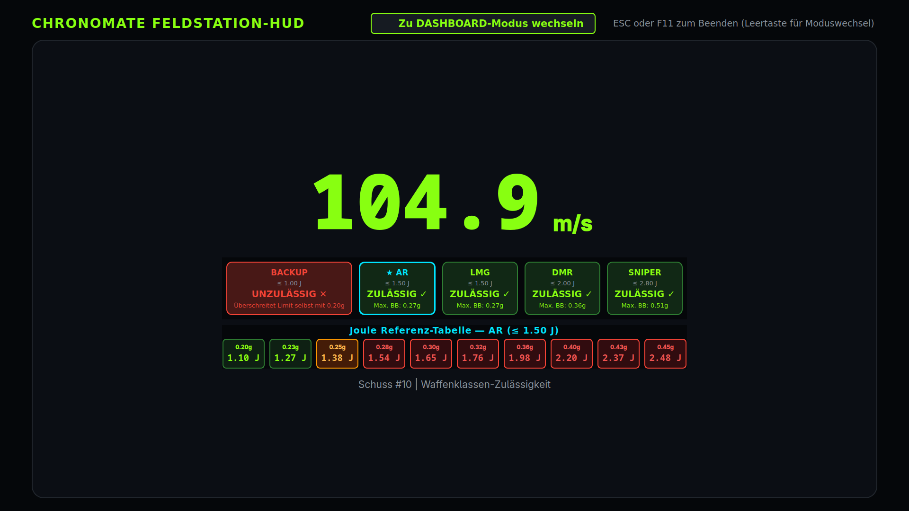 |

</details>

---

## 🚀 Key Features

### 📊 Advanced Dashboard
- **Real-Time Synchronization**: Background polling thread continuously reads live telemetry from the chronograph.
- **Auto-Discovery & Manual IP**: Automatically scans candidate IPs (`8.8.8.8`, `192.168.4.1`, `192.168.1.1`, `192.168.0.1`) or accepts custom manual IP overrides.
- **Interactive Velocity Trend Chart**: High-DPI anti-aliased velocity graph with gradient area fill, dashed average line, interactive hover tooltips, drag pan, and wheel zoom.
- **Statistical Analysis**: Instant computation of Average, Maximum, Minimum, Extreme Spread (ES), Standard Deviation (SD), and Rate of Fire (ROF).
- **Quick Weight Chips**: Instantly switch between standard BB weights (0.20g–0.45g), Diablos, or custom projectile weights.

### 🛡️ Orga Chrono (Marshaling Station)
- **Multi-Class Evaluation**: Evaluates measured velocity ($v$) across all airsoft classes (`BACKUP`, `AR`, `LMG`, `DMR`, `SNIPER`, and custom classes) simultaneously, indicating `LEGAL ✓` / `ILLEGAL ✕` with maximum allowable BB weight.
- **Drag & Drop Reordering**: Reorder weapon classes by dragging cards via their tactile `⋮⋮` grip handles. New order persists to `settings.json`.
- **Edit Weapon Classes (`✎`)**: Direct double-click or edit button to update limits, descriptions, or delete custom classes.
- **Click-to-Activate Reference Grid**: Click any weapon class card to dynamically re-evaluate the Joule Reference Grid against that class ceiling.

### 📺 Field Station HUD Mode (F11 Fullscreen)
- **Stage & Field Monitor Display**: High-visibility readouts designed for monitors or projectors visible across a chrono station.
- **Dual Mode Switching**: Press `Space` or click the mode button to toggle between Dashboard HUD and Orga Marshaling HUD.
- **Embedded Joule Reference Grid**: In Orga mode, displays a 10-column color-coded reference grid (Green = Safe, Orange = Limit, Red = Over limit) below compliance cards.
- **Click-to-Activate in HUD**: Click any card in HUD mode to activate it for real-time Joule grid recalculation.
- **Responsive Auto-Scaling**: Proportional scaling ensures crisp rendering without clipping on 4K, 1440p, 1080p, or 720p laptop screens.

### 🏹 Ballistics & Trajectory Simulation
- **Physics Engine**: Airsoft ballistic trajectory model accounting for Gravity, Aerodynamic Drag ($C_w$), Magnus Lift ($K$), and Spin Damping ($C_r$).
- **Dual Visual Display**: Side-by-side Trajectory Flight Path canvas and circular Target Reticle Point-of-Impact view.
- **Interactive Mouse Probing**: Hover or click anywhere on the curve to inspect Distance, Height, Velocity, Energy, Flight Time, and Hold-over.
- **Hop-Up Optimizer**: Automatically calculates optimal hop-up backspin (rad/s) maximizing effective range within allowed overhop limits.

### 📋 Session History & Management
- Save and reload named shooting sessions on demand (JSON format).
- Clean 5-column shot management table with reverse chronological ordering and shot deletion.

### 📄 Multi-Format Export
- **PDF Reports**: ReportLab-generated session reports with gun name, player call-sign, summary statistics, embedded trend graph, and full shot tables.
- **CSV Datasets**: Raw shot data for spreadsheets and ballistic analysis.
- **Excel (XLSX)**: Formatted workbooks with styled headers and summary metric blocks.

### ⚙️ Calibration & Settings
- **Chronograph Calibration**: Record test shots against a trusted reference chronograph. Supports **Median Ratio** and **Trust External** compensation modes.
- **Audio Feedback**: Zero-latency procedural sound effects (`Pew`, `Beep`, `Plink`, and `Over-Joule Alert`) powered by `pygame.mixer` with system CLI fallbacks.
- **Full Localization**: English and German (Deutsch) with instant language switching.
- **Virtual Chrono / Demo Mode**: Built-in simulator for offline testing without the physical chronograph.

---

## 🛠 Installation & Quick Start

### 🚀 One-Click Launcher (Recommended)

The launcher automatically detects Python 3, sets up a virtual environment if needed, installs any missing dependencies from `requirements.txt`, and boots the app:

#### Linux / macOS:
```bash
cd chronomate-desktop
./start.sh
```

#### Windows:
Double-click `start.bat` in File Explorer, or run in Command Prompt:
```cmd
cd chronomate-desktop
start.bat
```
*(PowerShell users can also run `.\start.ps1`)*

---

### Manual Setup

```bash
cd chronomate-desktop
pip install -r requirements.txt
python3 main.py
```

---

## ⌨️ Keyboard Shortcuts

| Key | Action |
|:---|:---|
| `F11` | Enter / Exit Full-Screen Field Station HUD Mode |
| `ESC` | Exit Full-Screen HUD Mode |
| `Space` | *(In HUD Mode)* Toggle between Dashboard Mode and Orga Marshaling Mode |
| `☀️ / 🌙` | Toggle between Tactical Dark and Clean Light themes |
